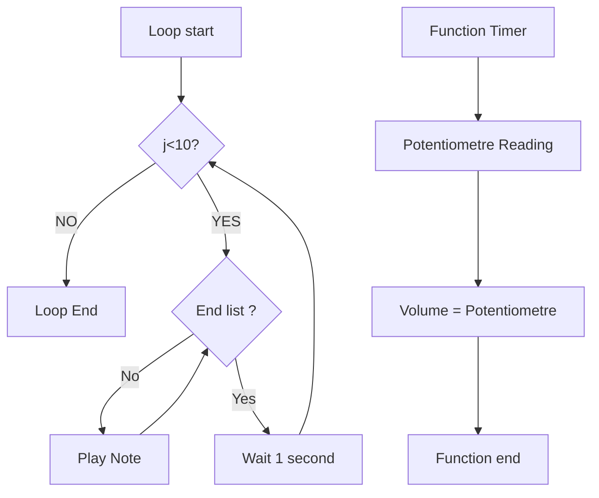

# Volume d'une mélodie
## Objectif
Créer un programme MicroPython qui permet de gérer le volume d'une mélodie jouée sur un buzzer. Le volume est contrôlé par un potentiomètre.

## Matériels
* Microcontrôleur compatible MicroPython (Raspberry Pi Pico W)
* Module potentiomètre
* Buzzer
* Câbles

## Câblage du Raspberry Pi Pico W
![Cablage_adpwm][Images_adpwm\cablage.png]

## Fonctionnement
Le programme travail avec une boucle et un timer. 

1. La boucle s'occupe de jouer des notes de musiques stockées dans une liste. 
    Dans cette liste on retrouve pour chaque note jouée, trois informations:
    * La fréquence de la note
    * Le temps pendant lequel la note doit être joué
    * Le temps de silence entre chaque note
    (Cette liste pourrait être une liste d'objet, nous sommes bien d'accord)

    La boucle joue 10 fois la séquence de note de la liste avant de s'arreté et attend une seconde avec de recommencer la mélodie.

2. Le timer appelle une fonction toutes les 100ms afin de regarder l'état du potentiomètre et ainsi, changer le volume du buzzer en "temps réel".

## Flowchart du fonctionnement

