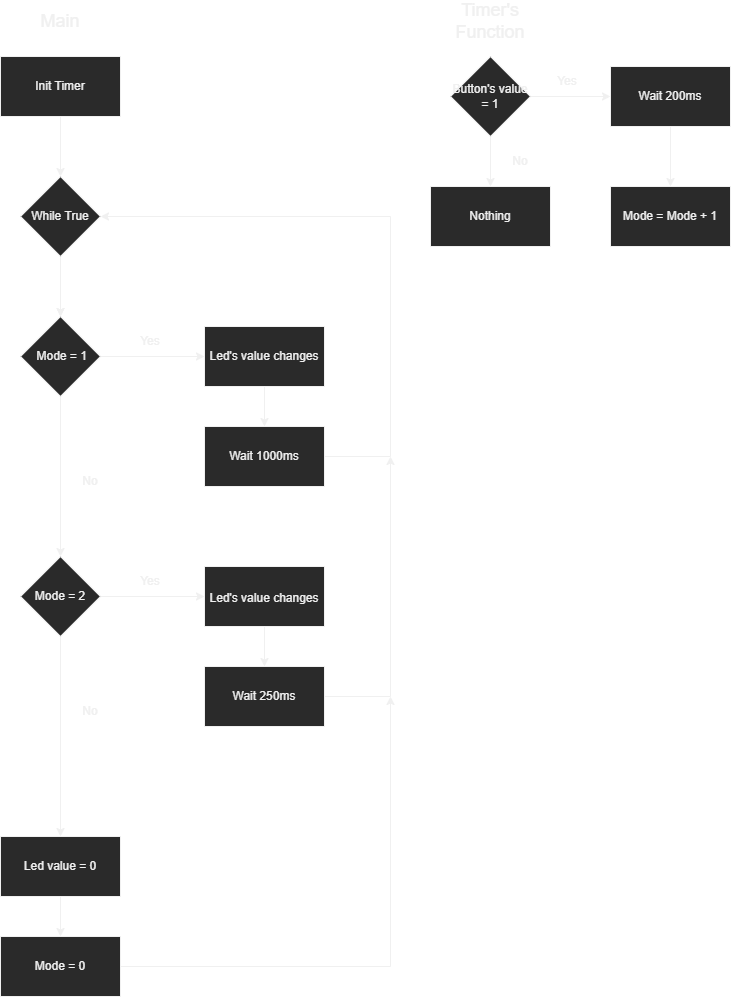
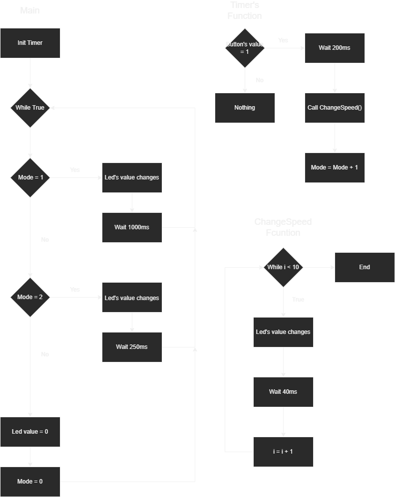

# Clignotement de LED avec un bouton poussoir
## Objectif
Créer un programme MicroPython qui permet de faire clignoter une LED à différentes vitesse en fonction du nombre de pressiosn sur un bouton poussoir.

## Matériel[^1]
* Microcontrôleur compatible MicroPython (Raspberry Pico W)
* Module LED
* Module bouton poussoir
* Câbles

## Fonctionnement
Le programme utilise un timer pour appeler une fonction toute les 100ms qui va regarder la valeur du bouton poussoir en prenant soin d'éviter les erreurs de rebond du bouton.
En parallèle du timer, le programme reste dans une boucle et surveille que la valeur du mode de foncitonnement (vitesse de clignotement de la LED) n'a pas changé.

### Flowchart Main

## Bonus
### Ajouter un délai dans le passage d'une vitesse de clignotement à une autre
Le programme est similaire mais au lieu de changer directement le mode de fonctionnement au changement de valeur du bouton poussoir. La fonction du timer appelle la fonction changeSpeed() qui fait clignoter 
la LED une fréquence de 12.5Hz 10 fois.

### Flowchart Bonus

[^1]: Le matériel provient d'un kit de base Grove
