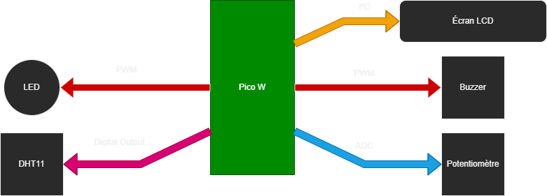
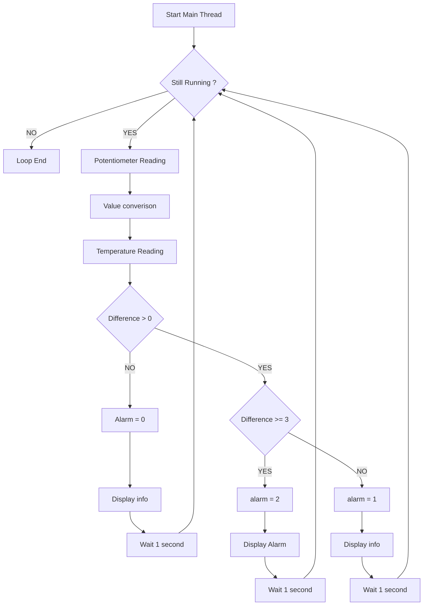
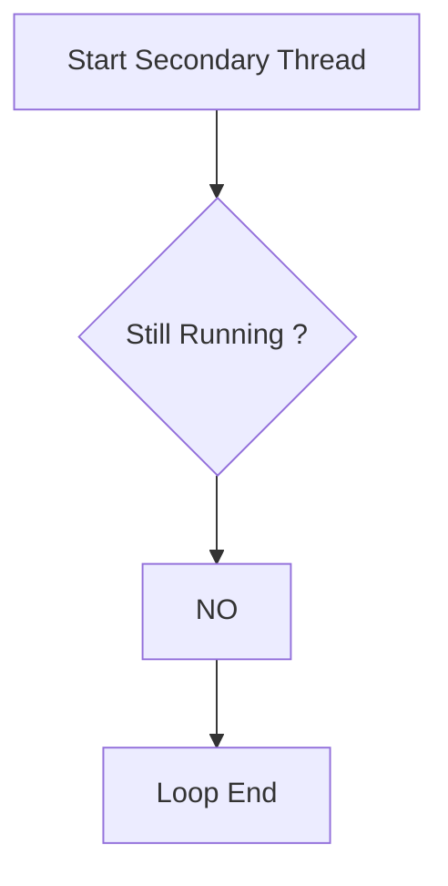

# Système de contrôle de température
## Objectif
Créeer un programme MicroPython qui permet de gérer un thermostat à plusieurs états.

## Matériels:
* Microcontrôleur compatible MicroPython (Rapsberry Pi Pico W)
* Module de capteur température/humidité
* Module LED
* Module potentiomètre
* Module écran LCD 2x16
* Module buzzer
* Câbles

## Câblage du Raspberry Pico W

## Fonctionnement
Le programme fonctionne avec deux Threads.
1. Thread Principal
    Dans ce Thread, on trouve un boucle chargé de faire une série d'opération et d'attendre une seconde avant de les refaires.
    Ce qu'on trouve dans la boucle:
    1. Lecture du potentiomètre et converstion.
        * La valeur définit par le potentiomètre doit être convertie afin que la valeur maximal du potentiomètre équivaut à 35° et que la valeur minimal devienne 15°.
        On connait la valeur maximal du potentiomètre, qui est de 65535. 
        Ce qui nous donne la formule temp=((val_potar/65535)*20)+15
    2. Lecture de la température
    3. Comparaison de la valeur définit par rapport à la température réel
        * Si la valeur réel est supérieur de 3° et plus par rapport a la température définit, la variable alarm passe à 2.
        * Si la température réel est supérieur à la température définit mais de moins de 3°, la variable alarm passe à 1.
        * Si la température réel est inférieur à la température définit, la variable alarm passe à 0.

2. Thread Secondaire - LEDBlinking
    Le Thread secondaire fonctionne aussi avec une boucle. Dans cette boucle, le Thread vérifié la valeur de la variable alarm toutes les secondes.
    * Si alarm vaut 0 : rien de spécial ne se passe.
    * Si alarm vaut 1 : la LED clignotte à une fréquence de 0,5Hz. 
    * Si alarm vaut 2 :alors la LED s'allume, le buzzer sonne et le mot "Alarm" apparait sur l'écran.

## Flowchart du fonctionnement

    