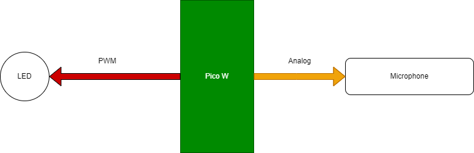

# Contrôle d'une led RGB en fonction du rythme de la musique
## Objectif
L'objectif de ce programme est de développer un script MicroPython qui permettra de contrôler une LED RGB connectée à un Raspberry Pico W, changeant de conleur au rythme de la musique.

## Matériels:
* Raspberry Pi Pico W
* Module microphone
* Module LED RGB
* Câbles

## Câblage du Raspberry Pico W


# Fonctionnement
Le programme lit et enregistre les valeurs captées par le microphone et fait la moyenne de ces valeur.
Cette moyenne permet de connaitre le volume de la musique.
Enfin, le programme compare cette moyenne avec une valeur fixé et change la couleur de la LED en fonction du volume atteint. 

## Flowchart du fonctionnement
```mermaid
flowchart TD
    Tp[Start program] --> Lp{True}
        Lp -- NO --> EndLoop[Loop End]
        Lp -- YES --> ReadL{I < 50}
            ReadL -- YES --> SouRead[Sound reading]
            SouRead --> addAv[Addition with the previous value]
            ReadL -- NO --> Average[Do the average]  
            Average --> if{Average > 15500}
            if -- NO --> ReadL
            if -- YES --> Led[Turn On LED]